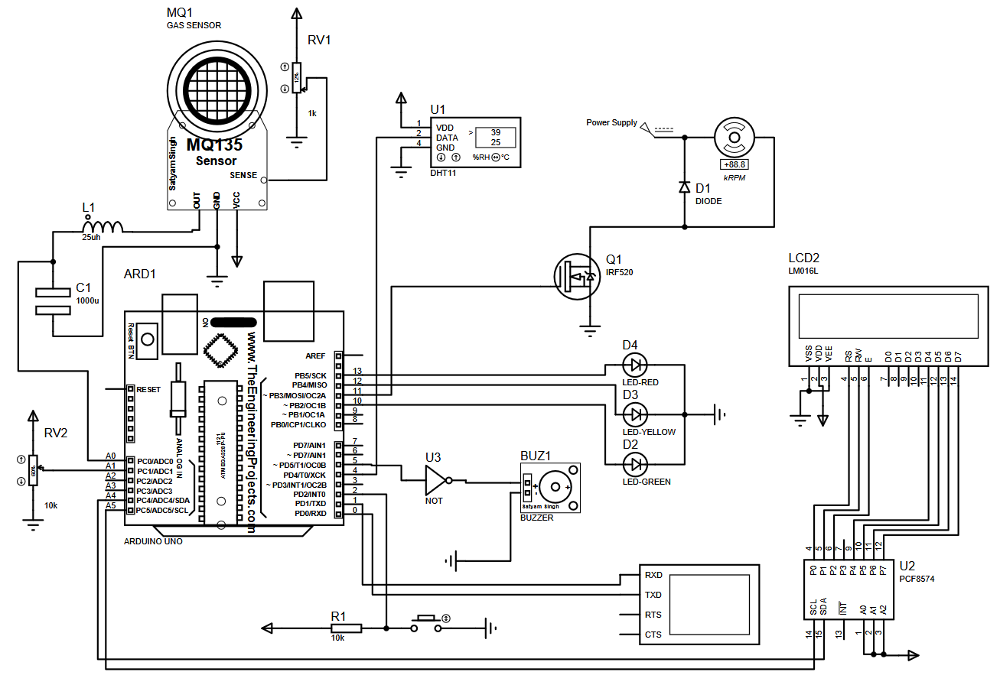
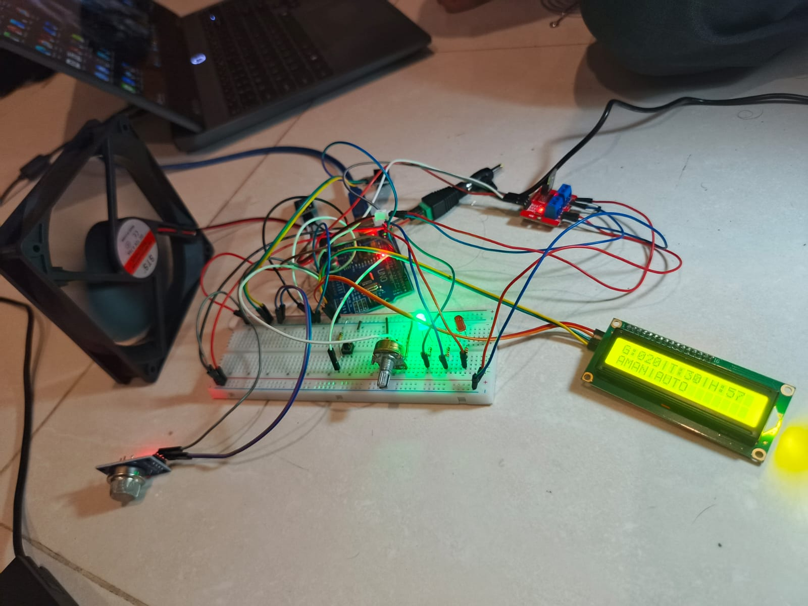
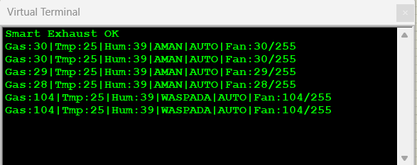

# Smart Air Exhaust System 🌬️

Sebuah sistem ventilasi ruangan cerdas berbasis mikrokontroler **ATmega328P (Arduino Uno)** yang diprogram menggunakan **AVR Assembly**. Sistem ini secara otomatis memantau kualitas udara dan suhu ruangan, serta mengendalikan kecepatan kipas *exhaust* secara proporsional demi efisiensi daya dan kelancaran sirkulasi udara.

Proyek Akhir Mata Kuliah *Embedded System* - Departemen Teknik Elektro, Universitas Indonesia. 

**Kelompok 9:** Qais Ismail, Muhammad Daffa Rizki, Akbar Anvasa Faraby, dan Zhafarrel Alvarezqi P K

---

## 1. Introduction to the Problem and the Solution

### The Problem
Ruangan tertutup dengan sirkulasi udara yang buruk (seperti laboratorium, dapur komersial, atau bengkel) memiliki risiko tinggi terhadap akumulasi gas berbahaya/asap dan peningkatan suhu ekstrem. Sistem *exhaust fan* konvensional umumnya dioperasikan secara manual (ON/OFF) atau berputar konstan pada kecepatan maksimal. Hal ini menyebabkan pemborosan energi listrik dan polusi suara saat kondisi udara sebenarnya bersih, serta kurang responsif ketika terjadi lonjakan emisi gas secara mendadak.

### The Solution
**Smart Air Exhaust System** hadir sebagai solusi berbasis *embedded system* cerdas. Sistem ini mengumpulkan data dari sensor kualitas udara (MQ-135) dan sensor suhu-kelembaban (DHT11) secara terus-menerus. Mikrokontroler mengolah data tersebut untuk menentukan status ruangan (AMAN, WASPADA, atau BAHAYA) dan menggerakkan kipas *exhaust* menggunakan sinyal PWM (*Pulse Width Modulation*) hibrida secara proporsional. 

Sistem dilengkapi dengan fitur-fitur tangguh seperti persistensi batas pemicu (EEPROM), interupsi perangkat keras darurat (*Manual Override*), indikator peringatan audio-visual, antarmuka lokal (LCD I2C), dan pencatatan *telemetry* (USART).

---

## 2. Hardware Design and Implementation Details

Sistem ini dirancang menggunakan arsitektur catu daya terpisah (*Standalone Power Supply*) untuk mencegah gangguan daya (tegangan *drop*) pada mikrokontroler saat motor DC berputar dengan kecepatan tinggi.

### Komponen Utama:
* **Microcontroller:** ATmega328P (Board Arduino Uno)
* **Gas Sensor:** MQ-135 (Terhubung ke ADC0)
* **Temp & Humidity Sensor:** DHT11 (Terhubung ke PD4)
* **Actuator:** DC Fan 12V 12cm
* **Motor Driver:** Modul MOSFET IRF520 (Terhubung ke PB3 / OC2A)
* **Display:** LCD 16x2 dengan I2C Backpack PCF8574 (Terhubung ke SDA/SCL)
* **Controls:** 10kΩ Potensiometer (ADC1) & Push Button (PD2 / INT0)
* **Indicators:** LED Hijau, Kuning, Merah & Modul Active Buzzer (PD5)
* **Power Supply:** Baterai 9V (Sistem Logika) & Adaptor 12V 2A (Aktuator Kipas)

### Skematik & Rangkaian Fisik





**Detail Implementasi Hardware:**
1. Pin `AOUT` MQ-135 digunakan agar rentang konsentrasi gas dapat dibaca presisi menggunakan ADC 10-bit.
2. Modul MOSFET digunakan untuk mengontrol kipas 12V via sinyal PWM 5V dari Arduino. Dioda Flyback (1N4001) dipasang paralel pada kipas untuk proteksi arus balik.
3. Tombol *override* dihubungkan ke INT0 dengan resistor *pull-up* 10kΩ eksternal untuk interupsi logika *Active-LOW* (Falling Edge).

---

## 3. Software Implementation Details

Perangkat lunak dibangun murni menggunakan bahasa **AVR Assembly** yang dibagi menjadi beberapa modul (`.S`) untuk memudahkan manajemen kode dan integrasi (Arsitektur Modular). 

### Modul Perangkat Lunak:
* `main.S`: Merupakan pusat eksekusi program. Menginisialisasi *stack pointer*, mengevaluasi status udara (Aman/Waspada/Bahaya), dan menampilkan paginasi pada LCD.
* `adc.S`: Menangani pembacaan ADC (MUX) untuk MQ-135 dan Potensiometer secara bergantian (*polling*).
* `dht11.S`: Implementasi *bit-banging* presisi dengan *delay* mikrodetik untuk membaca sinyal 40-bit dari sensor DHT11 beserta algoritma *clamping* data (pencegahan *overflow* suhu/kelembaban).
* `gpio.S`: Menangani konfigurasi dan inisialisasi pin *General Purpose I/O* (seperti pin LED, buzzer, port sensor, dan output PWM).
* `timer.S`: Mengonfigurasi Timer1 (Mode CTC) untuk interval *sampling* 1 detik dan Timer2 (Fast PWM) untuk manipulasi siklus kerja kipas.
* `interrupt.S`: Konfigurasi INT0 untuk menangkap interupsi eksternal (*Manual Override*).
* `i2c_lcd.S`: Implementasi protokol I2C TWI secara *low-level* untuk transmisi data *nibble* ke *display* LCD 16x2.
* `eeprom.S`: Fungsi `write` dan `read` memori EEPROM dilengkapi *Magic Byte* untuk menyimpan pengaturan *threshold* dari potensiometer.
* `usart.S`: Konfigurasi *baud rate* 9600 dan konversi Heksadesimal ke ASCII untuk *serial logging*.
* `macros.inc`: Berisi kumpulan definisi *macro* dan konstanta (*equates*) yang dapat digunakan ulang (reusable) di seluruh modul untuk membuat kode lebih rapi dan mempercepat penulisan instruksi repetitif.

### Cuplikan Kode (Evaluasi Status Logika)
```assembly
; File: main.S
; Evaluasi status udara berdasarkan gas_8bit dan threshold_8bit
evaluate_status:
    lds r16, gas_8bit
    lds r17, threshold_8bit
    mov r18, r17
    lsr r18 ; r18 = threshold / 2 (Batas Waspada = 50% Threshold)
    
    cp r16, r18
    brsh eval_check_warn
    ldi r16, STATUS_AMAN     ; Jika Gas < (Threshold/2) -> AMAN
    sts air_status, r16
    ret

eval_check_warn:
    lds r16, gas_8bit
    lds r17, threshold_8bit
    cp r16, r17
    brsh eval_bahaya
    ldi r16, STATUS_WASPADA  ; Jika (Threshold/2) <= Gas < Threshold -> WASPADA
    sts air_status, r16
    ret

eval_bahaya:
    ldi r16, STATUS_BAHAYA   ; Jika Gas >= Threshold -> BAHAYA
    sts air_status, r16
    ret
```

---

## 4. Test Results and Performance Evaluation

Pengujian fungsionalitas sistem telah dilakukan menggunakan berbagai skenario untuk memvalidasi integrasi Control Path dan Datapath dari program Assembly.

### Skenario & Hasil Pengujian

| Skenario Pengujian | Kondisi Lingkungan | Hasil & Perilaku Sistem |
| --- | --- | --- |
| **Normal (Aman)** | Gas bersih, Suhu < 30°C | LED Hijau menyala. Buzzer OFF. Kipas mati / putaran sangat rendah. LCD menampilkan "AMAN". |
| **Peningkatan Gas** | Gas terdeteksi (Waspada) | LED Kuning menyala. Buzzer berbunyi putus-putus. Kipas berputar proporsional (PWM sedang). |
| **Asap Pekat (Bahaya)** | Gas > Threshold | LED Merah menyala. Buzzer berbunyi kontinu. Kipas *exhaust* berputar maksimal (PWM 255). |
| **Suhu Panas** | Suhu > 30°C (Gas normal) | *Hybrid PWM* aktif: Algoritma memberikan bonus putaran kipas agar suhu cepat turun. |
| **Manual Override** | Tombol ditekan (*Interrupt*) | Sistem beralih ke mode MANUAL. Kipas langsung dipaksa berputar 100% tanpa melihat data sensor. |
| **Power Loss Test** | Baterai dicabut lalu dipasang | Nilai *threshold* terakhir dari potensiometer berhasil dimuat ulang dengan sempurna berkat pembacaan *Magic Byte* EEPROM. |

### Serial Monitor Logging



```text
Smart Exhaust OK
Gas:20|Tmp:28|Hum:65|AMAN|AUTO|Fan:20/255
Gas:80|Tmp:29|Hum:65|WASPADA|AUTO|Fan:120/255
Gas:200|Tmp:31|Hum:66|BAHAYA|AUTO|Fan:255/255
Gas:45|Tmp:28|Hum:65|AMAN|MANUAL|Fan:255/255
```

---

## 5. Conclusion and Future Work

### Kesimpulan

Proyek **Smart Air Exhaust System** telah berhasil diimplementasikan dan diverifikasi secara fungsional. Seluruh sistem beroperasi sesuai dengan spesifikasi, memanfaatkan bahasa *AVR Assembly* murni untuk mengintegrasikan 8 periferal mikrokontroler (GPIO, ADC, Timer, External Interrupt, EEPROM, USART, dan I2C). Kendali kecepatan kipas berbasis PWM hibrida terbukti jauh lebih adaptif dan hemat daya dibandingkan sistem ventilasi konvensional, sembari memberikan indikator peringatan keselamatan yang akurat bagi pengguna di ruangan.

### Future Work

Beberapa peningkatan yang dapat dikembangkan di masa mendatang:

1. **Integrasi IoT (Internet of Things):** Memanfaatkan modul ESP8266/ESP32 untuk mentransmisikan data *telemetry* ke *dashboard* *cloud* (seperti Blynk atau Thingspeak), sehingga notifikasi peringatan gas bocor dapat dikirimkan langsung ke *smartphone* pengguna.
2. **Custom PCB Design:** Memigrasikan rangkaian dari *breadboard* menuju *Printed Circuit Board* (PCB) cetak mandiri untuk menghilangkan *noise* listrik pada kabel *jumper* dan meningkatkan ketahanan sistem.
3. **3D Printed Enclosure:** Mendesain *casing* khusus berbahan ABS/PETG untuk melindungi sistem mikrokontroler dari korosi sirkulasi udara kotor.

---